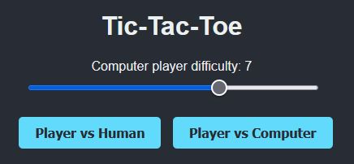
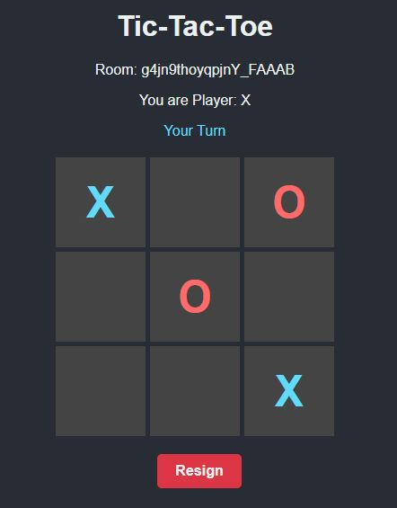
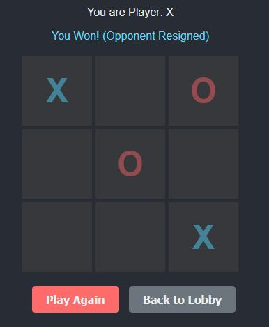

# Tic-Tac-Toe Multiplayer Server

A real-time multiplayer Tic-Tac-Toe game supporting online (Human vs Human) and single-player (Human vs Server-CPU) game modes.

## Features

- **Real-time Multiplayer**: Play against other online users.
- **Single Player Mode**: Play against computer with adjustable difficulty.
- **Matchmaking**: Automatic room creation and joining for PvP games.
- **Game Management**: Handles player disconnections, timeouts, resignations, and game resets.

## Screenshots







## Prerequisites

- NodeJS (Version 24.0.0 or higher)
- npm

## Installation

1. Clone the repository.
2. Install dependencies:

```bash
npm install
```

## Usage

### Development Mode

Rename the `.env.dev` file to `.env`.

To run the server in development mode with hot-reloading (using `nodemon` and `ts-node`):

```bash
npm run dev
```

### Production Build

```bash
npm run build
```

To start the prod server:

```bash
npm start
```
